# **Myhomepage**

Programming Language : Java

* 2023 자바 스프링 리액트로 완성하는 클라우드 활용 풀스택 개발에서 진행했던 2차 프로젝트 입니다.

---

## 메인 화면

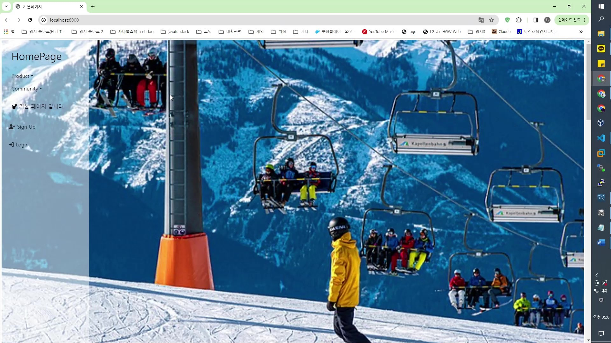
### 휠 애니메이션시, 다음 이미지 크기에 맞춰서 이동
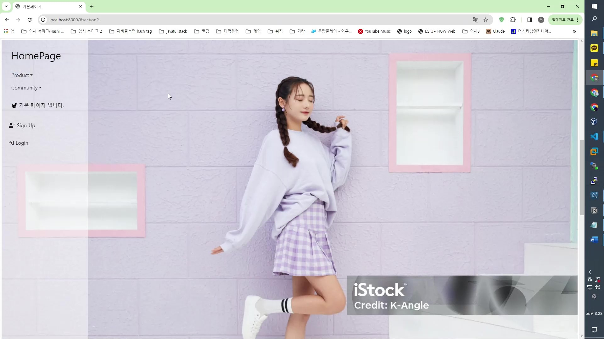

---
## 로그인 관련

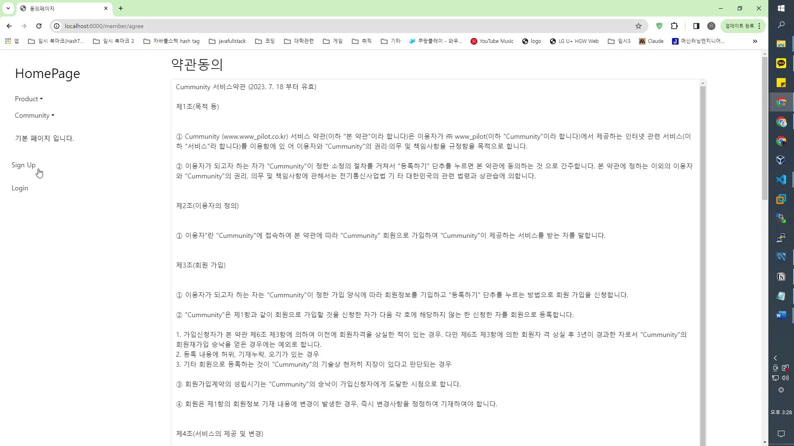
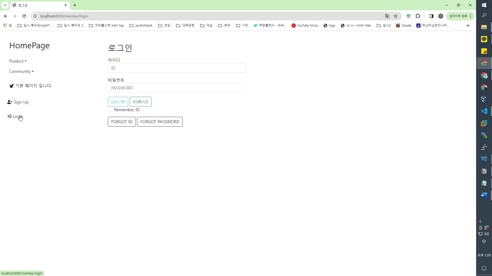
### 아이디 찾기 실패시, 존재하지 않다는 문구가 채워짐
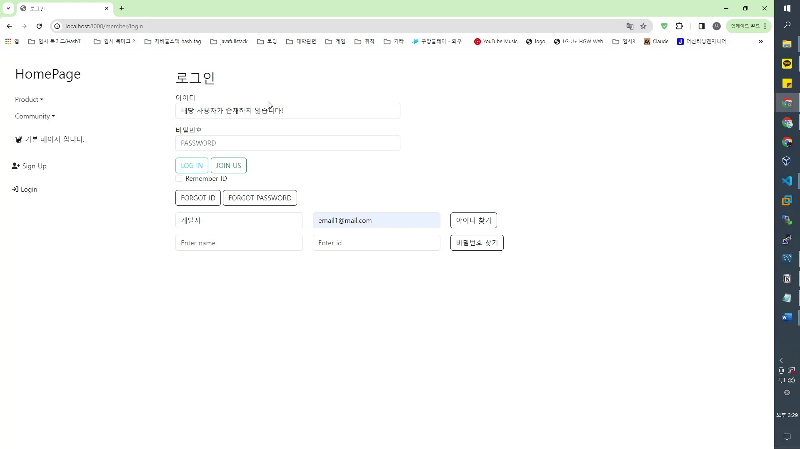
### 아이디 찾기 성공시, 아이디값이 채워짐
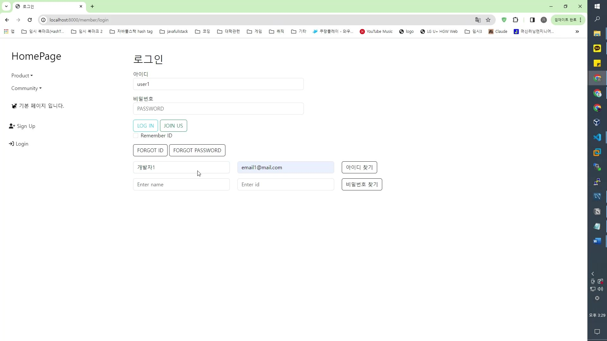

### 비밀번호는 실패시, 채워지지 않으며 성공시 비밀번호값이 채워짐
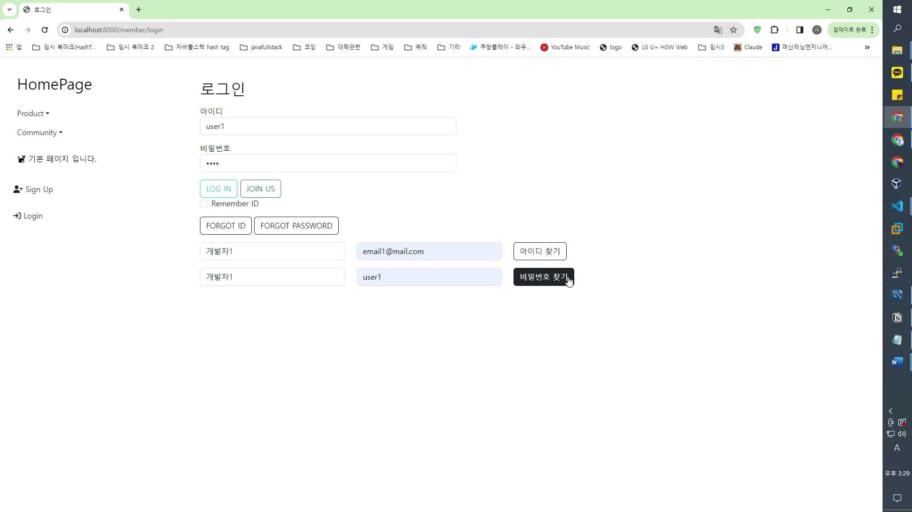

---
## 비로그인자 권한

### 공지사항 조회
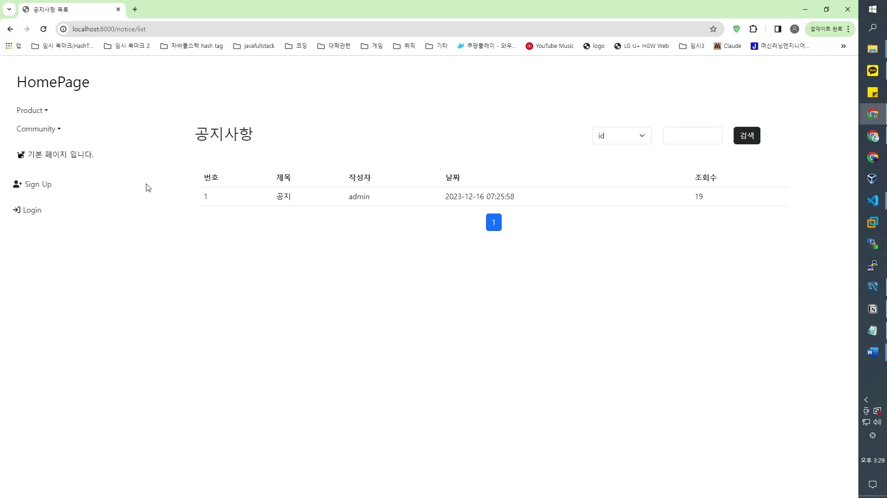
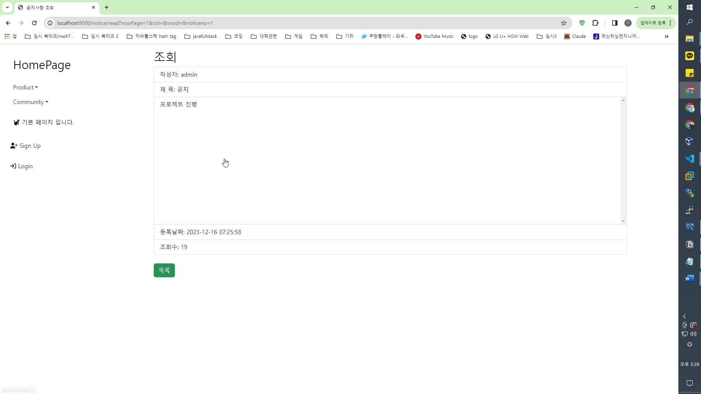

### 상품 조회
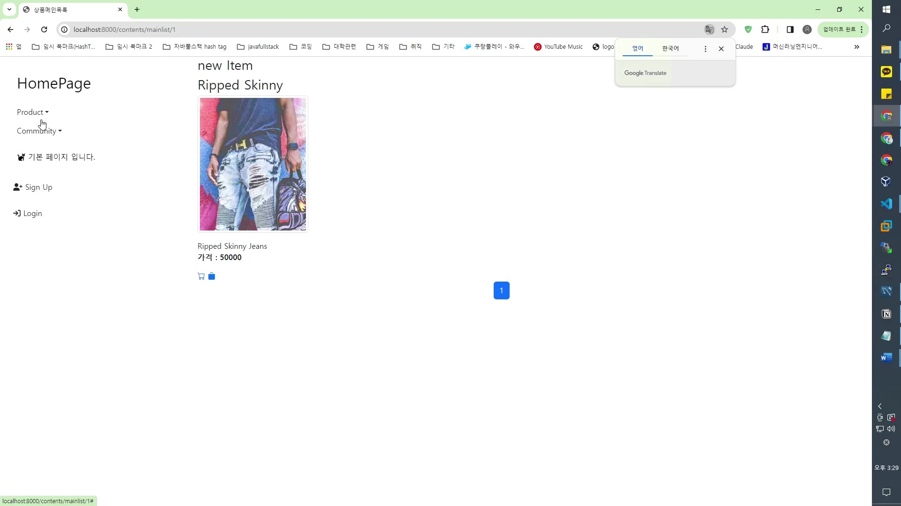
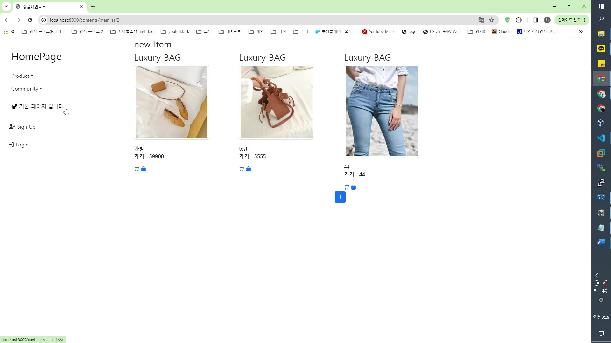

### 상품 상세페이지(별점 기능)
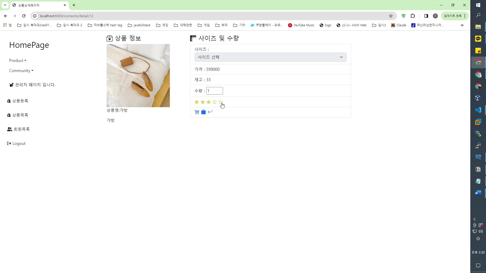

--
## 회원 권한

### 내정보 수정
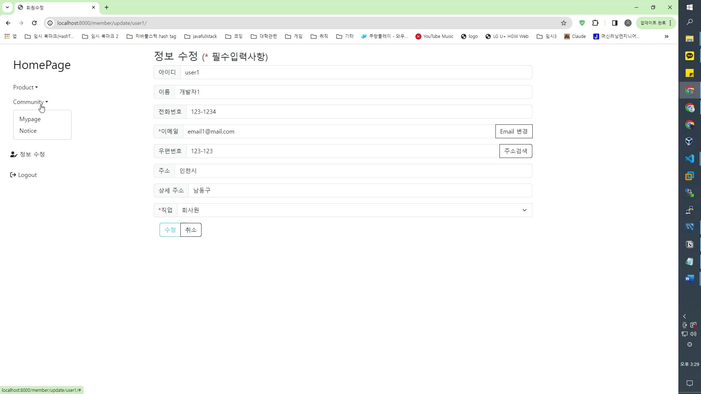

--
## 관리자 권한

### 일괄 상품목록 관리
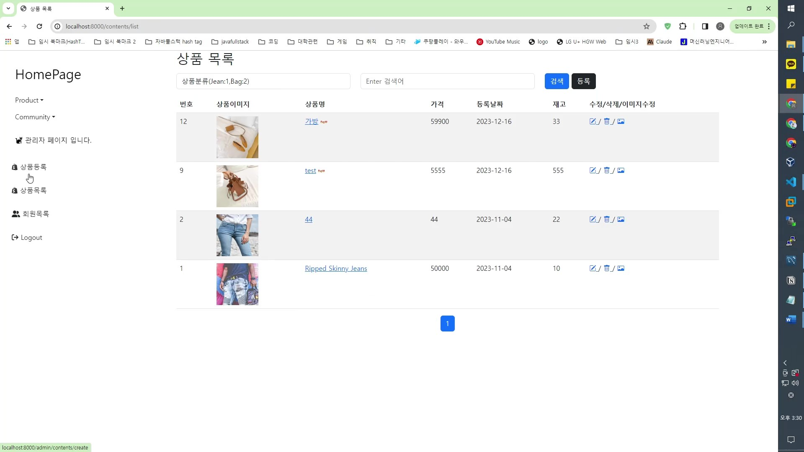
.jpg)
.jpg)

### 회원목록 관리
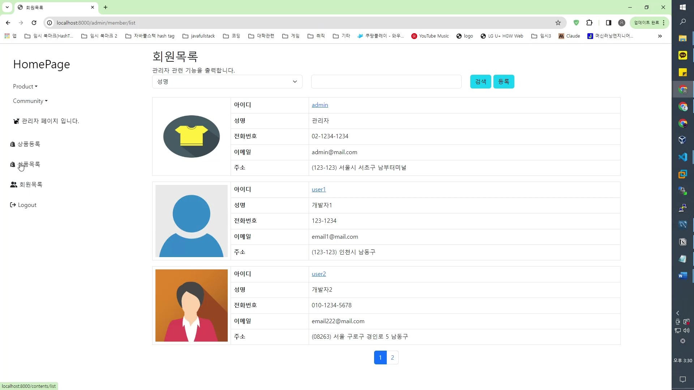
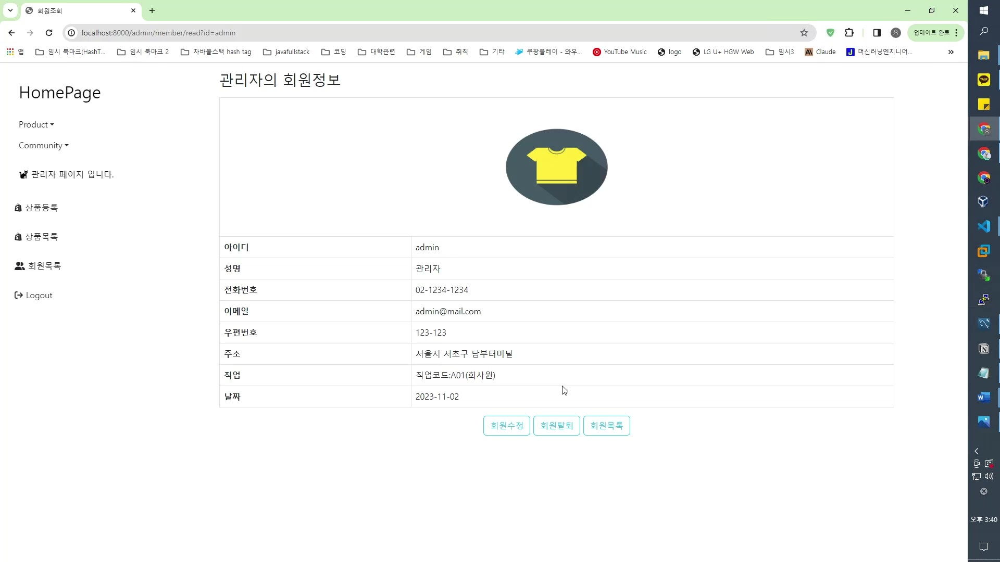
.jpg)